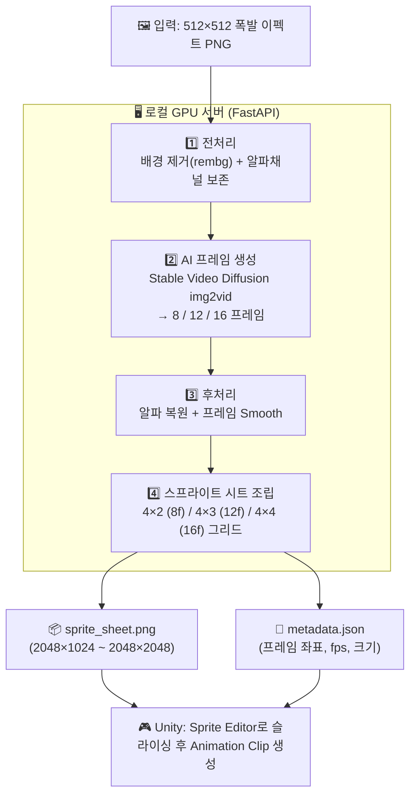

# 2D 폭발 이펙트 → Unity 스프라이트 시트 생성기 (최종 계획)

## 확정 조건

| 항목 | 결정 |
|---|---|
| 실행 환경 | 로컬 GPU 서버 (PyTorch + CUDA) |
| 출력 형식 | 스프라이트 시트 PNG + JSON 메타데이터 |
| 우선 이펙트 | 💥 폭발 (Explosion) |
| 프레임 해상도 | 512 × 512 px |
| 프레임 수 | 8 ~ 16장 (선택 가능) |

---

## 최종 아키텍처



---

## 스프라이트 시트 출력 규격

| 프레임 수 | 그리드 | 시트 해상도 |
|---|---|---|
| 8프레임 | 4 × 2 | 2048 × 1024 |
| 12프레임 | 4 × 3 | 2048 × 1536 |
| 16프레임 | 4 × 4 | 2048 × 2048 |

- 각 셀: **512 × 512 px**, 알파채널 포함 PNG
- Unity Sprite Editor의 **Grid by Cell Size** (512, 512) 슬라이싱으로 바로 분리 가능

---

## AI 모델: Stable Video Diffusion (SVD)

### 선택 이유
> 단일 이미지를 받아 여러 프레임의 연속 영상을 생성하는 img2vid 모델로,  
> "이미지 1장 → 애니메이션" 요구사항에 가장 직접적으로 대응

| 모델 | 특징 |
|---|---|
| `stabilityai/stable-video-diffusion-img2vid` | 14프레임, 576×1024 → 리사이즈 후 사용 |
| `stabilityai/stable-video-diffusion-img2vid-xt` | 25프레임, 더 부드러운 모션 |

**GPU 요구사항**: VRAM 12GB+ (fp16 기준), 8GB는 CPU offload 모드 가능

### 프레임 추출 전략 (폭발 특화)
```
SVD 생성 → 프레임 선별 (N장 균등 샘플링) → 512×512 크롭/리사이즈 → 알파 복원
```

폭발 이펙트는 중심에서 퍼지는 방향성이 있으므로:
1. 입력 이미지 = 폭발 절정 프레임 OR 초기 프레임
2. SVD가 자연스러운 팽창/소멸 모션 생성
3. 필요 시 **시간 반전**으로 초기 → 절정 → 소멸 시퀀스 조합

---

## 프로젝트 구조

```
animation-generator/
├── backend/
│   ├── models/
│   │   ├── frame_generator.py       ← SVD 파이프라인 (핵심)
│   │   ├── sprite_sheet_builder.py  ← 프레임 배열 → PNG 시트
│   │   └── preprocessor.py          ← 배경 제거 (rembg), 리사이즈
│   ├── api/
│   │   └── server.py                ← FastAPI + 비동기 작업 큐
│   └── requirements.txt
├── frontend/
│   ├── index.html                   ← 웹 UI
│   ├── style.css
│   └── main.js
└── docker-compose.yml               ← CUDA 컨테이너 구성
```

---

## 각 모듈 상세

### 1. `preprocessor.py`
- **rembg** (u2net 모델)로 배경 제거
- 알파채널 분리 저장 → 나중에 생성 프레임에 재적용 가능
- 512×512로 패딩 없이 리사이즈 (종횡비 유지 후 center-crop)

### 2. `frame_generator.py`
```python
# 핵심 인터페이스
def generate_frames(
    image: PIL.Image,          # 512×512 전처리된 입력
    num_frames: int = 8,       # 8 / 12 / 16
    motion_bucket_id: int = 127,  # 모션 강도 (높을수록 강함)
    fps: int = 12,             # 출력 FPS
    decode_chunk_size: int = 4,   # VRAM 절약 (낮출수록 메모리 절약)
) -> list[PIL.Image]
```

- `motion_bucket_id` 조절로 폭발의 강도 제어
- `decode_chunk_size` 조절로 VRAM 사용량 조절

### 3. `sprite_sheet_builder.py`
```python
def build_sprite_sheet(
    frames: list[PIL.Image],   # N × (512×512) RGBA 이미지들
    cols: int = 4,             # 열 수 (고정)
) -> tuple[PIL.Image, dict]    # (시트 PNG, 메타데이터 JSON)
```

메타데이터 JSON 예시:
```json
{
  "frame_width": 512,
  "frame_height": 512,
  "num_frames": 8,
  "cols": 4,
  "rows": 2,
  "fps": 12,
  "frames": [
    { "index": 0, "x": 0, "y": 0, "w": 512, "h": 512 },
    { "index": 1, "x": 512, "y": 0, "w": 512, "h": 512 }
  ]
}
```

### 4. `server.py` (FastAPI)
```
POST /api/generate
  Body (multipart): image=<file>, num_frames=8, fps=12, motion_strength=127
  Response (async): { job_id: "abc123" }

GET /api/status/{job_id}
  Response: { status: "pending|running|done|error", progress: 0~100 }

GET /api/result/{job_id}
  Response: { sprite_sheet_url: "...", metadata: {...}, preview_gif_url: "..." }
```

### 5. 웹 UI (`index.html`)
- 드래그 & 드롭 이미지 업로드
- 슬라이더: 프레임 수(8/12/16), 모션 강도
- 실시간 진행률 표시
- GIF 미리보기 (생성 후)
- 스프라이트 시트 PNG + JSON 다운로드

---

## 기술 스택 (확정)

| 레이어 | 기술 | 버전 |
|---|---|---|
| AI 모델 | Stable Video Diffusion (SVD) | img2vid / img2vid-xt |
| 배경 제거 | rembg | 2.0.x |
| 딥러닝 프레임워크 | PyTorch + CUDA | 2.x |
| 모델 라이브러리 | 🤗 diffusers | 0.27+ |
| 이미지 처리 | Pillow, OpenCV | - |
| API 서버 | FastAPI + uvicorn | - |
| 비동기 작업 | asyncio (단순) / Celery (확장) | - |
| 프론트엔드 | Vanilla HTML/CSS/JS | - |

---

## 개발 순서 (구체적)

```
Step 1. 환경 세팅
  - requirements.txt 작성 및 설치
  - CUDA 환경 확인 스크립트

Step 2. preprocessor.py 구현 및 테스트
  - rembg 배경 제거 테스트
  - 512×512 리사이즈 유틸리티

Step 3. frame_generator.py 구현
  - SVD 파이프라인 로드
  - VRAM에 따른 CPU offload 자동 감지
  - 샘플 폭발 이미지로 프레임 생성 테스트

Step 4. sprite_sheet_builder.py 구현
  - 그리드 배치 + 메타데이터 JSON 생성
  - 미리보기 GIF 생성 (imageio)

Step 5. FastAPI 서버 연결
  - 업로드 → 처리 → 결과 다운로드 엔드포인트

Step 6. 웹 UI 개발
  - 업로드 + 옵션 설정 + 결과 미리보기

Step 7. 통합 테스트
  - 폭발 샘플 이미지 5종으로 엔드-투-엔드 검증
```

---

## GPU VRAM별 실행 설정

| VRAM | 권장 설정 |
|---|---|
| 8 GB | `decode_chunk_size=2`, CPU offload 활성화, fp16 |
| 12 GB | `decode_chunk_size=4`, fp16 |
| 16 GB+ | 기본 설정, 빠른 추론 |

---

## 검증 계획

1. **모듈 단위 테스트**: preprocessing → frame gen → sheet builder 각각
2. **샘플 폭발 이미지 5종**: 무료 에셋 사이트(OpenGameArt)에서 다운로드하여 테스트
3. **Unity 임포트 확인**: 생성된 PNG를 Unity에 드래그, Sprite Editor로 4×2 슬라이싱 → Animator에서 재생 확인
4. **VRAM 측정**: `torch.cuda.memory_allocated()` 로 각 GPU 환경 적합성 확인
